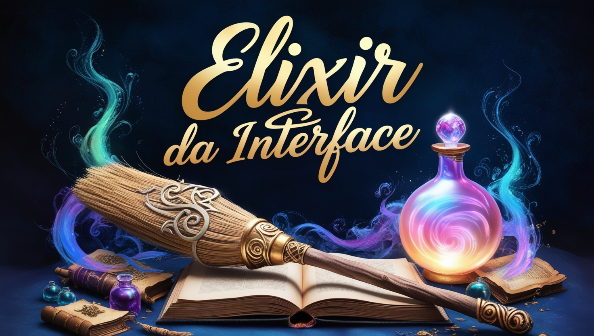

    <audio src="output/podcast_editado.MP3" controls title="Podcast editado"></audio>

# Projeto Podcast Gerado por I.A.s

Projeto com o objetivo de gerar um podcast utilizando ferramentas de IA através de prompts mais trabalhado.

Utilizer uma esteira de prompts para gerar cada etapa do processo criativo.

## 💻 Tecnologias utilizadas no projeto

- [ChatGPT](https://chat.openai.com/) 
- [Gemini](https://www.gemini.com/)
- [ElevenLabs](https://beta.elevenlabs.io/)
- [LeonardoAi](https://app.leonardo.ai/)

## ✨ Como foi feito ?

- Roteiro gerado via chatgpt e gemini
- Audio gerado pela elevenLabs
- Imagem de capa com Leonardo AI

## 👨‍💻 Expert

 Luísa Foppa 

